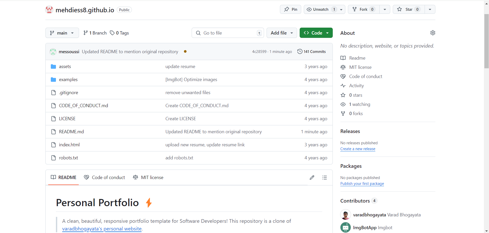

# Personal Portfolio ⚡️ 
> A clean, beautiful, responsive portfolio template for Software Developers!
>This repository is a clone of [varadbhogayata's personal website](https://github.com/varadbhogayata/varadbhogayata.github.io).

## Repository Screenshot

 
  <kbd>
    
  </a>
  </kbd>

## Updated Repository and Deployed Website Screenshots

 
  <kbd>
    
  </a>
  </kbd>

## Deployed Google Maps

 
  <kbd>
    
  </a>
  </kbd>

## Added dynamic projects

 
  <kbd>
    
  </a>
  </kbd>

 
  <kbd>
    
  </a>
  </kbd>

 

