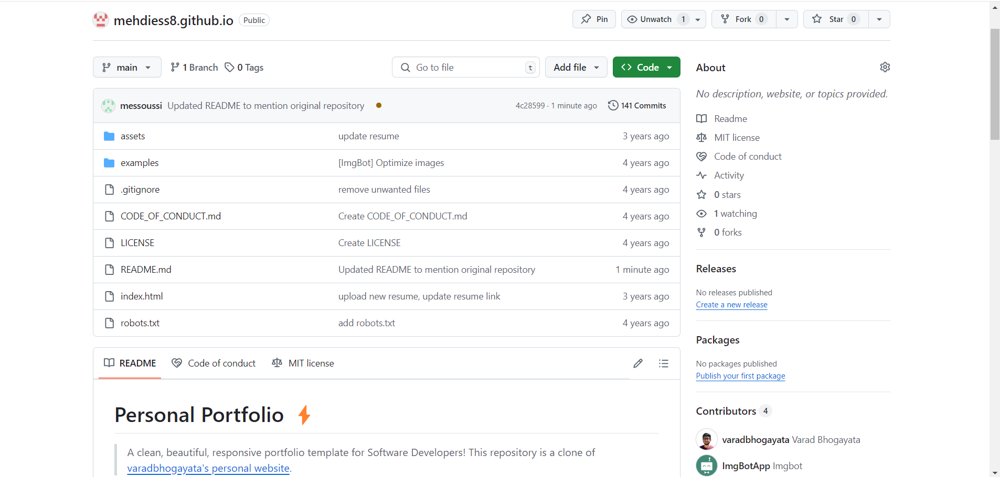

# robots.txt

```txt
# Group 1
User-agent: Googlebot
Disallow: /nogooglebot/

# Group 2
User-agent: *
Allow: /
```

# README.md

```md
# Personal Portfolio ⚡️ 
> A clean, beautiful, responsive portfolio template for Software Developers!
>This repository is a clone of [varadbhogayata's personal website](https://github.com/varadbhogayata/varadbhogayata.github.io).

## Repository Screenshot
<p align="center"> 
  <kbd>
    
  </a>
  </kbd>
</p>

## Updated Repository and Deployed Website Screenshots
<p align="center"> 
  <kbd>
    
  </a>
  </kbd>
</p>
<p align="center"> 
  <kbd>
    
  </a>
  </kbd>
</p>

## Deployed Google Maps
<p align="center"> 
  <kbd>
    
  </a>
  </kbd>
</p>


 

[](https://github.com/varadbhogayata/varadbhogayata.github.io/commits/master)
[](http://varadbhogayata.github.io/)
[](https://www.linkedin.com/in/varadbhogayata/)
[](http://badges.mit-license.org)

### Website Preview
<p align="center"> 
  <kbd>
    <a href="https://varadbhogayata.github.io" target="_blank">
  </a>
  </kbd>
</p>

:star: Star me on GitHub — it helps!

## Features 📋
⚡️ Fully Responsive\
⚡️ Valid HTML5 & CSS3\
⚡️ Typing animation using `Typed.js`\
⚡️ Easy to modify

## Installation & Deployment 📦
- Clone the repository and modify the content of <b>index.html</b> according to your requirement.
- Add or remove images from `varadbhogayata.github.io/assets/img/` directory as per your requirement.
- I highly recommend to use [Github Pages](https://create-react-app.dev/docs/deployment/#github-pages) to deploy the website the EASIEST WAY.
- To deploy your website, first you need to create github repository with name `<your-github-username>.github.io`. Please don't give any other name.
- Push the generated code to the `master` branch of this repository.
- <b>NOTE:</b> Make sure to set `analyticsId` from your Google Analytics account inside the Google Analytics script tag, if you want to use your own Google Analytics account.

## Sections 📚
✔️ About me\
✔️ Experience\
✔️ Projects \
✔️ Skills \
✔️ Education\
✔️ Contact Info\
✔️ Resume

To view a live example, **[click here](https://varadbhogayata.github.io/)**

## Tools Used 🛠️
* [<b>GitHub Pages</b>](https://create-react-app.dev/docs/deployment/#github-pages) - To host my static website (HTML, CSS, JS).
* [<b>Materialize</b>](https://materializecss.com/) - A CSS framework to get Google's Material Design components.
* [<b>Typed.js</b>](https://mattboldt.com/demos/typed-js/) - JavaScript Library

## Contributing 💡
#### Step 1

- **Option 1**
    - 🍴 Fork this repo!

- **Option 2**
    - 👯 Clone this repo to your local machine.


#### Step 2

- **Build your code** 🔨🔨🔨

#### Step 3

- 🔃 Create a new pull request.

## License 📄
This project is licensed under the MIT License - see the [LICENSE.md](./LICENSE) file for details.

```

# LICENSE

```
MIT License

Copyright (c) 2020 Varad Bhogayata

Permission is hereby granted, free of charge, to any person obtaining a copy
of this software and associated documentation files (the "Software"), to deal
in the Software without restriction, including without limitation the rights
to use, copy, modify, merge, publish, distribute, sublicense, and/or sell
copies of the Software, and to permit persons to whom the Software is
furnished to do so, subject to the following conditions:

The above copyright notice and this permission notice shall be included in all
copies or substantial portions of the Software.

THE SOFTWARE IS PROVIDED "AS IS", WITHOUT WARRANTY OF ANY KIND, EXPRESS OR
IMPLIED, INCLUDING BUT NOT LIMITED TO THE WARRANTIES OF MERCHANTABILITY,
FITNESS FOR A PARTICULAR PURPOSE AND NONINFRINGEMENT. IN NO EVENT SHALL THE
AUTHORS OR COPYRIGHT HOLDERS BE LIABLE FOR ANY CLAIM, DAMAGES OR OTHER
LIABILITY, WHETHER IN AN ACTION OF CONTRACT, TORT OR OTHERWISE, ARISING FROM,
OUT OF OR IN CONNECTION WITH THE SOFTWARE OR THE USE OR OTHER DEALINGS IN THE
SOFTWARE.

```

# index.html

```html
<!-- <!DOCTYPE html> -->
<html lang="en">

<head>
  <meta charset="utf-8" />
  <meta name="viewport" content="width=device-width initial-scale=1" />
  <meta http-equiv="X-UA-Compatible" content="IE=edge" />

  <!-- Google Tag Manager -->
  <script>(function(w,d,s,l,i){w[l]=w[l]||[];w[l].push({'gtm.start':
  new Date().getTime(),event:'gtm.js'});var f=d.getElementsByTagName(s)[0],
  j=d.createElement(s),dl=l!='dataLayer'?'&l='+l:'';j.async=true;j.src=
  'https://www.googletagmanager.com/gtm.js?id='+i+dl;f.parentNode.insertBefore(j,f);
  })(window,document,'script','dataLayer','GTM-PGZH8HT');</script>
  <!-- End Google Tag Manager -->

  <!-- Materialize - Compiled and minified CSS-->
  <link rel="stylesheet" href="//cdnjs.cloudflare.com/ajax/libs/materialize/0.95.3/css/materialize.min.css" />
  <!-- Font Awesome Icon - CSS-->
  <link rel="stylesheet" href="//maxcdn.bootstrapcdn.com/font-awesome/4.3.0/css/font-awesome.min.css" />
  <!-- Custom Styles-->
  <link rel="stylesheet" href="/assets/css/style.css" />
  <title>Mehdi Essoussi | Computer Engineering</title>

  <!-- Global site tag (gtag.js) - Google Analytics -->
  <script async src="https://www.googletagmanager.com/gtag/js?id=UA-126939217-2"></script>
  <script>
    window.dataLayer = window.dataLayer || [];
    function gtag() { dataLayer.push(arguments); }
    gtag('js', new Date());

    gtag('config', 'UA-126939217-2');
  </script>

  <!-- Open Graph-->
  <meta property="og:locale" content="en_US" />
  <meta property="og:type" content="website" />
  <meta property="og:title" content="Mehdi Essoussi | Computer Engineering" />
  <meta property="og:description" content="Software Developer" />
  <meta property="og:url" content="https://varadbhogayata.github.io/" />
  <meta property="og:site_name" content="Mehdi Essoussi | Computer Engineering" />
  <meta property="article:publisher" content="https://mehdiess8.github.io/" />
  <meta property="og:image" content="https://varadbhogayata.github.io/examples/preview.JPG" />
  <!-- Twitter -->
  <meta name="twitter:card" content="summary" />
  <meta name="twitter:site" content="@varad_bhogayata" />
  <meta name="twitter:title" content="Coder | Technofreak | Explorer | Minimalist | Humane" />
  <meta name="twitter:description" content="Software Developer" />
  <meta name="twitter:url" content="https://twitter.com/varad_bhogayata" />
  <meta name="author" content="Mehdi Essoussi" />
  <meta name="description" content="Software Developer with a passion for backend development and artificial intelligence." />
  <link rel="apple-touch-icon" sizes="57x57" href="/assets/img/favicon/apple-icon-57x57.png" />
  <link rel="apple-touch-icon" sizes="60x60" href="/assets/img/favicon/apple-icon-60x60.png" />
  <link rel="apple-touch-icon" sizes="72x72" href="/assets/img/favicon/apple-icon-72x72.png" />
  <link rel="apple-touch-icon" sizes="76x76" href="/assets/img/favicon/apple-icon-76x76.png" />
  <link rel="apple-touch-icon" sizes="114x114" href="/assets/img/favicon/apple-icon-114x114.png" />
  <link rel="apple-touch-icon" sizes="120x120" href="/assets/img/favicon/apple-icon-120x120.png" />
  <link rel="apple-touch-icon" sizes="144x144" href="/assets/img/favicon/apple-icon-144x144.png" />
  <link rel="apple-touch-icon" sizes="152x152" href="/assets/img/favicon/apple-icon-152x152.png" />
  <link rel="apple-touch-icon" sizes="180x180" href="/assets/img/favicon/apple-icon-180x180.png" />
  <link rel="icon" type="image/png" sizes="192x192" href="/assets/img/favicon/android-icon-192x192.png" />
  <link rel="icon" type="image/png" sizes="32x32" href="/assets/img/favicon/favicon-32x32.png" />
  <link rel="icon" type="image/png" sizes="96x96" href="/assets/img/favicon/favicon-96x96.png" />
  <link rel="icon" type="image/png" sizes="16x16" href="/assets/img/favicon/favicon-16x16.png" />
  <link rel="manifest" href="/assets/img/favicon/manifest.json" />
  <meta name="msapplication-TileColor" content="#ffffff" />
  <meta name="msapplication-TileImage" content="/assets/img/favicon/ms-icon-144x144.png" />
  <meta name="theme-color" content="#ffffff" />
  <meta name="robots" content="index, follow" />
  <!-- Google Site Verification for indexing -->
  <meta name="google-site-verification" content="_qxK8tePiU2fhnwlwnJ7pkDFnj1k2EiKq_cYGy1Cb84" />
</head>

<body>
  <!-- Google Tag Manager (noscript) -->
  <noscript><iframe src="https://www.googletagmanager.com/ns.html?id=GTM-PGZH8HT"
  height="0" width="0" style="display:none;visibility:hidden"></iframe>
  </noscript>
  
  <!-- Navigation Menu-->
  <!-- Nav class 1 -->
  <nav class="hide-on-small-only">
    <ul class="side-nav fixed section table-of-contents">

      <li class="logo">
        <a id="logo-container" aria-label="Navigate to the beginning of the page" href="#intro"
          class="brand-logo grey-blue-text">
          
        </a>
      </li>

      <li class="bold">
        <a aria-label="Navigate to the About section" href="#about" class="waves-effect waves-dark teal-text"><i
            class="mdi-social-person small"></i><span>About</span></a>
      </li>
      <li class="bold">
        <a aria-label="Navigate to the Experience section" href="#experience"
          class="waves-effect waves-dark teal-text"><i
            class="mdi-action-trending-up small"></i><span>Experience</span></a>
      </li>

      <li class="bold">
        <!-- mdi-av-web small
             mdi-av-my-library-books small-->
        <a aria-label="Navigate to the Projects section" href="#projects" class="waves-effect waves-dark teal-text"><i
            class="mdi-av-my-library-books small"></i><span>Projects</span></a>
      </li>

      <li class="bold">
        <!--
        ICONS:
        mdi-action-assessment
        mdi-social-poll
        mdi-av-equalizer
        -->
        <a aria-label="Navigate to the Skills section" href="#skills" class="waves-effect waves-dark teal-text"><i
            class="mdi-action-assessment small"></i><span>Skills</span></a>
      </li>
      
      <li class="bold">
        <!--
        ICONS:
        -->
        <a aria-label="Navigate to the Education section" href="#education" class="waves-effect waves-dark teal-text"><i
            class="mdi-social-school small"></i><span>Education</span></a>
      </li>

      <li class="bold">
        <!-- 
        1. mdi-communication-contacts
        2. mdi-content-mail
        3. mdi-communication-email
        -->
        <a aria-label="Navigate to the Contact section" href="#contact" class="waves-effect waves-dark teal-text"><i
            class="mdi-content-mail small"></i><span>Contact</span></a>
      </li>

      <li class="bold">
        <!--
        ICONS:
        1. mdi-action-description
        2. mdi-file-folder
        3. mdi-file-folder-open
        4. mdi-file-attachment
        5. mdi-file-folder-shared
        -->
        <!-- <a aria-label="Open Varad's resume in a new tab" href="#resume" target="_blank"
          onclick="window.open('https://drive.google.com/file/d/1vYi-bMyIsZPve0x_clxY8xsDtiHiOMd3/view?usp=sharing')"
          class="waves-effect waves-dark teal-text"><i class="mdi-file-folder-open small"></i><span>Resume</span></a> -->
        <a aria-label="Open Mehdi's resume in a new tab" href="https://mehdiess8.github.io/assets/resume/Mehdi.Essoussi_Resume.pdf" target="_blank"
        class="waves-effect waves-dark teal-text"><i class="mdi-file-folder-open small"></i><span>Resume</span></a>  
      </li>
    </ul>
  </nav>

  <!-- Nav class 2 -->
  <nav class="hide-on-large only trigger z-depth-1">
    <a aria-label="Toggle visibility of the mobile navbar" href="#" data-activates="slide-out"
      class="button-collapse"><i class="mdi-navigation-menu"></i></a>
    <div class="name-title">
      <a id="name" aria-label="Navigate to the beginning of the page" href="#" class="teal-text">Varad
        Bhogayata</a><span class="black-text">Software Developer</span>
    </div>
  </nav>

  <!-- Nav class 3 -->
  <nav class="hide-on-large only">
    <ul id="slide-out" class="side-nav">
      <li class="bold">
        <a aria-label="Navigate to the About section" href="#about" class="waves-effect waves-dark teal-text"><i
            class="mdi-social-person small"></i><span>About</span></a>
      </li>
      <li class="bold">
        <a aria-label="Navigate to the Experience section" href="#experience"
          class="waves-effect waves-dark teal-text"><i
            class="mdi-action-trending-up small"></i><span>Experience</span></a>
      </li>
      <li class="bold">
        <a aria-label="Navigate to the Projects section" href="#projects" class="waves-effect waves-dark teal-text"><i
            class="mdi-av-my-library-books small"></i><span>Projects</span></a>
      </li>
      <li class="bold">
        <a aria-label="Navigate to the Skills section" href="#skills" class="waves-effect waves-dark teal-text"><i
            class="mdi-action-assessment small"></i><span>Skills</span></a>
      </li>

      <li class="bold">
        <a aria-label="Navigate to the Education section" href="#education" class="waves-effect waves-dark teal-text"><i
            class="mdi-social-school small"></i><span>Education</span></a>
      </li>
      <li class="bold">
        <a aria-label="Navigate to the Places Traveled section" href="#places-traveled" class="waves-effect waves-dark teal-text">
          <i class="mdi-maps-place small"></i><span>Places Traveled</span>
        </a>
      </li>      
      <li class="bold">
        <a aria-label="Navigate to the Contact section" href="#contact" class="waves-effect waves-dark teal-text"><i
            class="mdi-content-mail small"></i><span>Contact</span></a>
      </li>
      <li class="bold">
        <a aria-label="Open Mehdi's Resume in a new tab"
          href="https://drive.google.com/file/d/1B6MZ1z0-7NsefC3Lm_q-uhib28MTqpE9/view?usp=sharing" target="_blank"
          class="waves-effect waves-dark teal-text"><i class="mdi-file-folder-open small"></i><span>Resume</span></a>
      </li>
    </ul>
  </nav>

  <!-- Main Content-->
  <main>
    <!-- First Section: Heading lines and image -->
    <section id="intro" class="section scrollspy full-height">
      <div class="overlay"></div>
      <div class="container">
        <div class="col-md-9">
          <div class="content section-padding valign" style="margin-left: 10%; margin-top: 50px;">
            <div class="caption">
              <h2>Hi, I'm <span class="teal">Mehdi Essoussi.</span></h2>
              <h5 style="color:#fff">A <span class="typing" style="font-weight: 300; color:#004d40"></span></h5>
              <!-- <h5 style="color:#00796b">A <span class="typing" style="font-weight: 300; color:#fff"></span></h5> -->
              <h5>Hardworking and enthusiastic 4th year university
                student working towards a B.S. in Electrical and
                Computer Engineering at the University of Toronto
                with a minor in Artficial Intelligence and Business.
                </h5>
            </div>
            <div class="social">
              <a href="www.linkedin.com/in/mehdi-essoussi-120a782a2" target="_blank">
                <button class="icon-btn linkedin">
                  <i class="fa fa-linkedin"></i>
                </button>
              </a>
              <a href="https://github.com/mehdiess8/" target="_blank">
                <button class="icon-btn github">
                  <i class="fa fa-github"></i>
                </button>
              </a>

              <!-- <a href="https://angel.co/u/varad_bhogayata" target="_blank">
                <button class="icon-btn angellist">
                  <i class="fa fa-angellist"></i>
                </button>
              </a> -->

              <!-- <a href="http://linkedin.com/in/varadbhogayata" target="_blank">
                  <span class="fa-stack fa-lg">
                    <i class="fa fa-circle fa-stack-2x"></i>
                    <i class="fa fa-linkedin fa-stack-1x fa-inverse"></i>

                  </span>
              </a> -->
            </div>
            <div class='buttons'>
              <a href="#about" class="readme">Read More</a>
              <a href="#contact" class="contactme">Contact Me</a>
            </div>
          </div>
        </div>
      </div>
    </section>

    <!-- Second Section: About -->
    <section id="about" class="section scrollspy">
      <h3 class="page-title white-text teal">About</h3>
      <div class="container flow-text">
        <!-- <blockquote>
          <h2>
            A Software Developer with a passion for Backend Development and Artificial Intelligence.

          </h2>
        </blockquote> -->        
        <p>
          I am hardworking and enthusiastic 4th year university
student working towards a B.S. in Electrical and
Computer Engineering at the University of Toronto
with a minor in Artficial Intelligence and Business.
Seeking to use my knowledge of software
development, coding and problem solving to
effectively serve your company in an internship
position. Dedicated and committed to becoming a
dependable and valuable team member.
        </p>
        <p>
          <ul>
            <li><b>Languages:</b> Python, Java, JavaScript, C, C++, HTML/CSS</li>
            <li><b>Databases:</b> MySQL, PostgreSQL, MongoDB</li>
            <li><b>Libraries:</b> NumPy, Pandas, OpenCV</li>
            <li><b>Frameworks:</b> Flask, Django, Node.js, PyTorch</li>
            <li><b>Tools & Technologies:</b> Git, Docker</li>
          </ul>
          
        </p>
          
        <!-- <p>
          
          Detail-oriented Software Developer with professional experience in Backend Development, Machine Learning, Computer Vision. I am adept in Python, Django, Flask, SQL, Machine Learning, Computer Vision.           
        </p> -->
        <p>
          Looking for an opportunity to work in a challenging position combining my skills in Software Engineering, which provides professional development, interesting experiences and personal growth.
        </p>
        <!-- <p>
          Another Paragraph
        </p>  -->
        <!-- <p>
        <strong>Current Focus</strong>:&nbsp;<a aria-label="Navigate to the Inclusive Design Patterns homepage"
          href="https://www.smashingmagazine.com/inclusive-design-patterns/">Accessibility</a>&nbsp;//&nbsp;<a
          aria-label="Navigate to the Full Stack React homepage"
          href="https://www.fullstackreact.com/">React</a>&nbsp;//&nbsp;<a
          aria-label='Navigate to the article "Scalable CSS"'
          href="https://mrmrs.github.io/writing/2016/03/24/scalable-css/">Design Systems</a>
        </p> -->
      </div>
    </section>


    <!-- Third Section: Experience -->
    <section id="experience" class="section scrollspy">
      <h3 class="page-title white-text teal">Experience</h3>
      <div class="container">

        <!-- Latest Experience -->
        <div class="card">
          <div class="card-content">
            <div class="row">
              <div class="col s12 m2">
                <a href="https://www.30fe.com/" target="_blank"></a>
              </div>
              <!-- <div class="col s12 m10"> -->
              <div class="col s12 m10">
                <p>
                  <span class="card-title"><a href="https://www.zhiffy.com/" target="_blank"
                      class="teal-text hoverline">30 Forensic Engineering</a></span>
                </p>
              </div>
            </div>
            <div class="role brown-text text-darken-2">IT Intern</div>
            <ul>
              <li>
                Worked closely with the IT Manager, gaining hands-on experience in various IT projects
              </li>
              <li>
                Worked on one major in-house project developping an AI-agent-powered chatbot about to facilitate report writing for forensic engineering experts.
              </li>
              <li>Worked on this project by myself, implementing the backend and frontend of the app and using AI-agent-powered chatbot technology.</li>
              <li>Used available APIs to allow the chatbot to search for information about a specific case and to generate reports.</li>
              <li>Used UI libraries to style the frontend of the app.</li>
              <li>
                <b>Tools:</b> Python, React, TailwindCSS
              </li>
            </ul>
          </div>
          <div class="card-action">
            <span>June 2024 - September 2024 | Toronto, Canada</span>
          </div>
        </div>

       

    <!-- Fourth Section: Projects -->
    <section id="projects" class="section scrollspy">
      <h3 class="page-title white-text teal">Projects</h3>
      <div class="container">
        <div class="row">

          <div class="col s12 m6 l4">
            <div class="card medium">
              <div class="card-image waves-effect waves-block waves-light">
                
              </div>
              <div class="card-content">
                <span class="card-title activator teal-text hoverline">Music Player Web-App<i
                    class="mdi-navigation-more-vert right"></i></span>
                <p>
                  A music streaming web app based on Django
                </p>
              </div>
              <div class="card-reveal">
                <!-- TODO: change this -- only close button -->
                <!-- <span class="card-title brown-text">Accomplishments<i class="mdi-navigation-close right"></i></span> -->
                <span class="card-title grey-text"><small>Accomplishments</small><i
                    class="mdi-navigation-close right"></i></span>
                <ul>
                  <li><b>Tools:</b> Django, HTML, CSS, Bootstrap, SQLite, AWS S3, Heroku</li>
                  <li>Register/login to the web app(with OAuth-based Google Sign-In).</li>
                  <li>Search and filter songs based on language and singer.</li>
                  <li>Create multiple playlists and add/remove songs to/from playlist.</li>
                  <li>Scroll through recently played/viewed songs.</li>


                </ul>
                <div class="card-action">
                  <a aria-label="Visit " href="https://galvanic-music.herokuapp.com/" target="_blank" data-position="top"
                    data-tooltip="View Online"
                    class="btn-floating btn-large waves-effect waves-light blue-grey tooltipped"><i
                      class="fa fa-external-link"></i></a>
                  <a aria-label="Visit the GitHub repo for  project" href="https://github.com/varadbhogayata/music-player"
                    target="_blank" data-position="top" data-tooltip="View Source"
                    class="btn-floating btn-large waves-effect waves-light blue-grey tooltipped"><i
                      class="fa fa-github"></i></a>
                </div>
              </div>
            </div>
          </div>

          <div class="col s12 m6 l4">
            <div class="card medium">
              <div class="card-image waves-effect waves-block waves-light">
                
              </div>
              <div class="card-content">
                <span class="card-title activator teal-text hoverline">Quiz Web-App<i
                    class="mdi-navigation-more-vert right"></i></span>
                <p>
                  A quiz playing web app based on Django
                </p>
              </div>
              <div class="card-reveal">
                <!-- TODO: change this -- only close button -->
                <!-- <span class="card-title brown-text">Accomplishments<i class="mdi-navigation-close right"></i></span> -->
                <span class="card-title grey-text"><small>Accomplishments</small><i
                    class="mdi-navigation-close right"></i></span>
                <ul>
                  <li><b>Tools:</b> Django, HTML, CSS, Bootstrap, SQLite, Heroku</li>
                  <li>Register/login to the web app(with OAuth-based Google Sign-In).</li>
                  <li>Play Quiz and see the leaderboard</li>

                </ul>
                <div class="card-action">
                  <a aria-label="Visit " href="https://quiz-up-app.herokuapp.com/" target="_blank" data-position="top"
                    data-tooltip="View Online"
                    class="btn-floating btn-large waves-effect waves-light blue-grey tooltipped"><i
                      class="fa fa-external-link"></i></a>
                  <a aria-label="Visit the GitHub repo for  project" href="https://github.com/varadbhogayata/QuizUp"
                    target="_blank" data-position="top" data-tooltip="View Source"
                    class="btn-floating btn-large waves-effect waves-light blue-grey tooltipped"><i
                      class="fa fa-github"></i></a>
                </div>
              </div>
            </div>
          </div>

          <!-- 1. Django Project -->
          <!-- <div class="col s12 m6 l6">
            <div class="card medium">
              <div class="card-image waves-effect waves-block waves-light">
                
              </div>
              <div class="card-content">
                <span class="card-title activator teal-text hoverline">Local Library Web-App<i
                    class="mdi-navigation-more-vert right"></i></span>
                <p>
                  A web-app that creates an online catalog for a small local library, where users can browse available books and manage their accounts.
                </p>
              </div>
              <div class="card-reveal">
                <span class="card-title grey-text"><small>Accomplishments</small><i
                    class="mdi-navigation-close right"></i></span>
                <ul>
                  <li><b>Tools:</b> HTML, CSS, Bootstrap, SQLite, Django, Heroku</li>
                  <li>Users can view list and detail information for books and authors.</li>
                  <li>Admin users can create and manage models.</li>
                  <li>Librarians can renew reserved books.</li>

                </ul>
                <div class="card-action">
                  <a aria-label="Visit " href="https://django-local-lib.herokuapp.com" target="_blank" data-position="top"
                    data-tooltip="View Online"
                    class="btn-floating btn-large waves-effect waves-light blue-grey tooltipped"><i
                      class="fa fa-external-link"></i></a>
                  <a aria-label="Visit the GitHub repo for  project" href="https://github.com/varadbhogayata/django-local-library"
                    target="_blank" data-position="top" data-tooltip="View Source"
                    class="btn-floating btn-large waves-effect waves-light blue-grey tooltipped"><i
                      class="fa fa-github"></i></a>
                </div>
              </div>
            </div>
          </div> -->

          

          <!-- ************* -->
        </div>
      </div>
    </section>

    <!-- Fifth Section: Skills -->
    <section id="skills" class="section scrollspy">
      <h3 class="page-title white-text teal">Skills</h3>
      <div class="container">
        <!-- Languages and Databases -->
        <div class="card">
          <div class="card-content">
            <h4 class="brown-text light">Languages and Databases</h4>
            <div class="row text-center">
              <div class="col s4 m2">
                Python
              </div>
              <div class="col s4 m2">
                HTML5
              </div>
              <div class="col s4 m2">
                MySQL
              </div>
              <div class="col s4 m2">
                Shell Scripting
              </div>
            </div>
          </div>
        </div>

        <div class="card">
          <div class="card-content">
            <h4 class="brown-text light">Libraries</h4>
            <div class="row text-center">
              <div class="col s4 m2">
                NumPy
              </div>
              <div class="col s4 m2">
                Pandas
              </div>
              <div class="col s4 m2">
                matplotlib
              </div>
            </div>
          </div>
        </div>

        <!-- Frameworks -->
        <div class="card">
          <div class="card-content">
            <h4 class="brown-text light">Frameworks</h4>
            <div class="row text-center">
              <div class="col s4 m2">
                Django
              </div>
              <div class="col s4 m2">
                Flask
              </div>
            </div>
          </div>
        </div>

        <!-- Other -->
        <div class="card">
          <div class="card-content">
            <h4 class="brown-text light">Other</h4>
            <div class="row text-center">


              <div class="col s4 m2">
                Git
              </div>
            </div>
          </div>
        </div>

        <!-- certifications -->
        <!-- <div class="card">
          <div class="card-content">
            <h4 class="brown-text light">Certificates</h4>
            <div class="row text-left">
              <div class="container">
                <div class="row">
                  <div class="col s12 m6 l6">
                    <div class="card">
                      <div class="card-image">
                        
                      </div>
                      <div class="card-content">
                        <span class="card-title teal-text">Machine Learning (Stanford)</span>
                      </div>
                    </div>
                  </div>

                  <div class="col s12 m6 l6">
                    <div class="card">
                      <div class="card-image">
                        
                      </div>
                      <div class="card-content">
                        <span class="card-title teal-text">Algorithms (Stanford)</span>
                      </div>
                    </div>
                  </div>
                </div>
              </div>
            </div>
          </div>
        </div> -->

      </div>
    </section>

    <!-- Seventh Section: Education -->
    <section id="education" class="section scrollspy">
      <h3 class="page-title white-text teal">Education</h3>
      <div class="container">
        <div class="row">
          <!-- Education -->
          <div class="col s12 m6 l6">
            <div class="card">
              <div class="card-content">
                <p>
                  <span class="card-title"><a href="https://www.utoronto.ca/" target="_blank" class="teal-text hoverline">University of Toronto</a></span>
                </p>
                <p class="brown-text">Toronto, Canada</p>
                <p>
                  <b>Degree: </b>Bachelor of Science in Electrical and Computer Engineering      
                  <br>
                </p>

                <ul>
                  <p>
                    <b>Relevant Courseworks:</b>
                  <ul>

                    <li>ECE110: Electrical Fundamentals</li>
                    <li>ECE241: Digital Systems</li>
                    <li>ECE244: Programming Fundamentals</li>
                    <li>ECE212: Circuit Analysis</li>
                    <li>ECE216: Signals and systems</li>
                    <li>ECE221: Electric and Magnetic fields</li>
                    <li>ECE243: Computer Organization</li>
                    <li>ECE297: Software Design and Communication</li>
                    <li>ECE361: Computer Networks </li>
                    <li>ECE342: Computer Hardware</li>
                    <li>ECE344: Operating Systems</li>                  
                  </ul>
                  </p>

                </ul>
              </div>
            </div>

            
          </div>
        </div>
      </div>
    </section>

    <!-- Eight Section: Contact -->
    <section id="contact" class="section scrollspy full-height">
      <h3 class="page-title white-text teal">Contact</h3>
      <div class="container">
        <p>
          <a aria-label="Call Varad" data-position="top" data-tooltip="Call Varad"
            class="btn-floating btn-large waves-effect waves-light blue-grey tooltipped"><i class="fa fa-phone"></i><a
              aria-label="Call Varad">+14379989777</a></a>
        </p>
        <p>
          <a aria-label="Email Varad" href="mailto:mehdi8.ess@gmail.com" target="_blank" data-position="top"
            data-tooltip="Email Varad" class="btn-floating btn-large waves-effect waves-light blue-grey tooltipped"><i
              class="fa fa-envelope"></i><a aria-label="Email Varad" href="mailto:mehdi8.ess@gmail.com"
              class="hoverline">mehdi8.ess@gmail.com</a></a>
        </p>
        <p>
          <a aria-label="View Varad on GitHub" href="http://github.com/mehdiess8" target="_blank"
            data-position="top" data-tooltip="View Varad on GitHub"
            class="btn-floating btn-large waves-effect waves-light blue-grey tooltipped"><i class="fa fa-github"></i><a
              aria-label="Varad on Github" href="http://github.com/varadbhogayata" class="hoverline"
              target="_blank">github.com/mehdiess8</a></a>
        </p>
        <p>
          <a aria-label="View Varad on LinkedIn" href="www.linkedin.com/in/mehdi-essoussi-120a782a2" target="_blank"
            data-position="top" data-tooltip="View Varad on LinkedIn"
            class="btn-floating btn-large waves-effect waves-light blue-grey tooltipped"><i
              class="fa fa-linkedin"></i><a aria-label="Varad on LinkedIn" href="www.linkedin.com/in/mehdi-essoussi-120a782a2"
              class="hoverline" target="_blank">www.linkedin.com/in/mehdi-essoussi-120a782a2</a></a>
        </p>
      </div>
    </section>

    <section id="places-traveled" class="section scrollspy">
      <h3 class="page-title white-text teal">Places Traveled</h3>
      <div class="container">
        <p>Here are some of the places I have visited.</p>
        <div id="map">
          <iframe src="https://www.google.com/maps/d/embed?mid=1J7gEJqwzqqUkuAngbm1LnM8DdivEt7g&ehbc=2E312F"
            width="600" height="450" style="border:0;" allowfullscreen="" loading="lazy">
          </iframe>
        </div>
      </div>
    </section>
    
  </main>

  <!-- typed.js -->
  <script src="assets/vendor/typed.js/typed.min.js"></script>
  <script type="text/javascript">
    var typed = new Typed('.typing',{
      strings: ["Pythonist", "Developer", "Fast Learner"],
      loop: true,
      typeSpeed: 80,
      backSpeed: 40
    });
  </script>


  <!-- jQuery-->
  <script src="https://ajax.googleapis.com/ajax/libs/jquery/1.11.2/jquery.min.js"></script>

  <!-- Materialize - Compiled and minified JavaScript-->
  <script src="https://cdnjs.cloudflare.com/ajax/libs/materialize/0.95.3/js/materialize.min.js"></script>
  <script>
    // Materialize - Initializers
    $(document).ready(function () {
      $(".scrollspy").scrollSpy()
      // Initialize collapse button
      $(".button-collapse").sideNav({
        menuWidth: 190, // Default is 240
        edge: "left", // Choose the horizontal origin
        closeOnClick: true // Closes side-nav on <a> clicks, useful for Angular/Meteor
      })
    })
  </script>
</body>

</html>

```

# CODE_OF_CONDUCT.md

```md
# Contributor Covenant Code of Conduct

## Our Pledge

In the interest of fostering an open and welcoming environment, we as
contributors and maintainers pledge to making participation in our project and
our community a harassment-free experience for everyone, regardless of age, body
size, disability, ethnicity, sex characteristics, gender identity and expression,
level of experience, education, socio-economic status, nationality, personal
appearance, race, religion, or sexual identity and orientation.

## Our Standards

Examples of behavior that contributes to creating a positive environment
include:

* Using welcoming and inclusive language
* Being respectful of differing viewpoints and experiences
* Gracefully accepting constructive criticism
* Focusing on what is best for the community
* Showing empathy towards other community members

Examples of unacceptable behavior by participants include:

* The use of sexualized language or imagery and unwelcome sexual attention or
 advances
* Trolling, insulting/derogatory comments, and personal or political attacks
* Public or private harassment
* Publishing others' private information, such as a physical or electronic
 address, without explicit permission
* Other conduct which could reasonably be considered inappropriate in a
 professional setting

## Our Responsibilities

Project maintainers are responsible for clarifying the standards of acceptable
behavior and are expected to take appropriate and fair corrective action in
response to any instances of unacceptable behavior.

Project maintainers have the right and responsibility to remove, edit, or
reject comments, commits, code, wiki edits, issues, and other contributions
that are not aligned to this Code of Conduct, or to ban temporarily or
permanently any contributor for other behaviors that they deem inappropriate,
threatening, offensive, or harmful.

## Scope

This Code of Conduct applies both within project spaces and in public spaces
when an individual is representing the project or its community. Examples of
representing a project or community include using an official project e-mail
address, posting via an official social media account, or acting as an appointed
representative at an online or offline event. Representation of a project may be
further defined and clarified by project maintainers.

## Enforcement

Instances of abusive, harassing, or otherwise unacceptable behavior may be
reported by contacting the project team at vbhogayata@gmail.com. All
complaints will be reviewed and investigated and will result in a response that
is deemed necessary and appropriate to the circumstances. The project team is
obligated to maintain confidentiality with regard to the reporter of an incident.
Further details of specific enforcement policies may be posted separately.

Project maintainers who do not follow or enforce the Code of Conduct in good
faith may face temporary or permanent repercussions as determined by other
members of the project's leadership.

## Attribution

This Code of Conduct is adapted from the [Contributor Covenant][homepage], version 1.4,
available at https://www.contributor-covenant.org/version/1/4/code-of-conduct.html

[homepage]: https://www.contributor-covenant.org

For answers to common questions about this code of conduct, see
https://www.contributor-covenant.org/faq

```

# .gitignore

```


```

# images\screenshot1.png.png

This is a binary file of the type: Image

# images\Screenshot 2024-09-20 002347.png

This is a binary file of the type: Image

# images\Screenshot 2024-09-19 224918.png

This is a binary file of the type: Image

# images\Screenshot 2024-09-19 224804.png

This is a binary file of the type: Image

# examples\preview.JPG

This is a binary file of the type: Image

# examples\preview.gif

This is a binary file of the type: Image

# assets\resume\Varad_Bhogayata_Resume.pdf

This is a binary file of the type: PDF

# assets\resume\Mehdi_Essoussi_Resume.pdf

This is a binary file of the type: PDF

# assets\css\style.css

```css
.profile-pic {
  position: relative;
  max-width:130px;
  max-height:130px;
  width: auto;
  height: auto;
  overflow: hidden;
  /* display: inline-block; */
  
  
  /* background-size: cover;  */
  margin: -31px; 
  margin-left:-7px;
  border: 6px solid #246A73; 
  border-radius: 50% !important;
}

.profile-pic img {
  width: 100%;
  height: auto;
}

.tracker {
  /* visibility: hidden; */
  position: fixed;
  /* margin-inline-end: auto;  */
  bottom: 0; 
  right: 0;
}

@import url(https://fonts.googleapis.com/css?family=Poiret+One);
.social {
  margin: 0 auto;
  width: auto;
  text-align: inherit;
  /* padding: 10px; */
}

.icon-btn {
  margin-left: auto;
  width: 50px;
  height: 50px;
  border: 0;
  color: #FFFFFF;
  cursor: pointer;
  font-size: 30px;
  line-height: 70px;
  border-radius: 45px;
  display: inline-block;
  margin: 4px;
}

.github {
  color: black;
}

.linkedin {
  color: #0077b5;
}

.angellist {
  color: grey;
}

.icon-btn:hover {
  transform: scale(1.10);
  color: #FFFFFF;
}

.linkedin:hover {
  background-color: #0077b5;
}

.angellist:hover {
  background-color: grey;
}

.github:hover {
  background-color: black;
}

/* Buttons - Read Me, Contact Us */

.readme {
  position: relative;
  padding: 11px 35px;
  background: #fff;
  color: #368F8B;
  border: 2px solid #fff;
  font-weight: 600;
  font-size: 15px;
  letter-spacing: 1px;
  display: inline-block;
  border-radius: 5px;
  -webkit-border-radius: 5px;
}

/* .readme:hover{
  color: white;
  background-color: #00796b;
} */

.contactme {
  position: relative;
  padding: 11px 35px;
  background: none;
  color: #fff;
  border: 2px solid #fff;
  font-weight: 600;
  font-size: 15px;
  letter-spacing: 1px;
  display: inline-block;
  margin-top: 1.5em;
  border-radius: 5px;
  -webkit-border-radius: 5px;
}

.contactme:hover{
  color: #00796b;
  background-color: white;
}
/* main body */

/* body-color */

body {
  color: #333;
  font-size: 18px;
}

/* body {
  color: black;
  font-size: 18px;
} */

/* main a -- links */

/* a {
  color: #009688;
} */

a {
  color: #58A4B0;
}

/* main blockqoute */

/* blockquote {
  border-left: 5px solid #795548;
  color: #795548;
  font-size: 125%;
  font-weight: 400;
  margin: 20px 0;
  padding-left: 1.5rem;
} */

blockquote {
  border-left: 5px solid #795548;
  color: #795548;
  font-size: 125%;
  font-weight: 400;
  margin: 20px 0;
  padding-left: 1.5rem;
}

blockquote * {
  font-size: inherit;
  line-height: inherit;
}

.text-center {
  text-align: center;
}

/* main nav */

nav {
  background: white;
  box-shadow: none;
  height: 0;
}

/* nav {
  background: rgb(149, 126, 212);
  box-shadow: none;
  height: 0;
} */

nav i {
  padding: 0 15px;
  position: relative;
  top: 5px;
}

/* main */

/* main {
  background: url(../../assets/img/bg.png) repeat;
  padding-left: 190px;
} */

main {
  background: url(../../assets/img/bg.png) repeat;
  padding-left: 190px;
}

dl {
  margin-top: 0.5rem;
}

dd {
  display: inline-block;
  font-weight: 500;
  margin-left: 0;
}

dt {
  display: inline-block;
  margin-left: 0.5rem;
}

ul.side-nav {
  width: 190px;
}

ul.side-nav li {
  padding: 0;
}

/* ul.side-nav.fixed a {
  box-sizing: content-box;
  color: rgb(48, 122, 207);
  display: block;
  line-height: 100%;
  padding: 10px 0 12px;
} */

ul.side-nav.fixed a {
  box-sizing: content-box;
  color: rgb(16, 202, 56);
  display: block;
  line-height: 100%;
  padding: 10px 0 12px;
}

ul.table-of-contents li.logo a.active, ul.table-of-contents li.logo a:hover {
  border: none;
  font-weight: 200;
}

/* ul.side-nav.fixed li.logo {
  background-color: #fafafa;
  border-bottom: 1px solid #ddd;
  box-sizing: content-box;
  min-height: 90px;
  padding: 30px 30px 40px;
} */

ul.side-nav.fixed li.logo {
  background-color: #fafafa;
  border-bottom: 1px solid #ddd;
  box-sizing: content-box;
  min-height: 90px;
  padding: 30px 30px 40px;
}

ul.side-nav.fixed li.logo a {
  font-weight: 200;
  line-height: 100%;
}

ul.table-of-contents li:not(.logo) a.active, ul.table-of-contents li:not(.logo) a:hover {
  background-color: #fafafa;
  border-left: 3px solid;
}

ul.side-nav.fixed.table-of-contents li:not(.logo) a span, ul#slide-out li:not(.logo) a span {
  color: #333 !important;
}

li.logo span {
  display: block;
  font-size: 14px;
}

.brand-logo h1 {
  font-size: inherit;
  line-height: inherit;
  margin: inherit;
  font-weight: inherit;
}

.container {
  width: 95%;
}

h3 {
  font-weight: 200;
  margin-bottom: 60px;
  margin-top: 0;
  padding: 30px 40px;
  text-transform: uppercase;
}

.section {
  padding-bottom: 30px;
  padding-top: 0;
  position: relative;
}

.full-height {
  height: 100vh;
}

/* Original */

/* #intro.section {
  background: url(../../assets/img/white-ai-wallpaper.jpg) no-repeat top center/cover;
  position: relative;
} */

#intro.section {
  background: #a7ffeb repeat;
  position: relative;
}

#intro.section .container {
  color: white;
  font-weight: 200;
  left: 0;
  position: absolute;
  top: 0;
}

/* #intro.section .container *:not(span) {
  font-weight: 300;
  line-height: 150%;
  padding: 0 30px;
  text-shadow: 1px 1px 5px rgba(0, 0, 0, 0.5);
} */

#intro.section .container *:not(span) {
  font-weight: 300;
  /* font-weight: 400; */
  line-height: 150%;
  /* padding: 0 0px; */
  text-shadow: 1px 1px 5px rgba(0, 0, 0, 0.5);
}

#intro.section .underline {
  border-bottom: 5px solid #24305e;
}

#intro.section .teal {
  padding: 0 10px;
}

.overlay {
  background-color: rgba(0, 0, 0, 0.4);
  height: 100%;
  left: 0;
  position: absolute;
  top: 0;
  width: 100%;
}

.waves-effect.waves-blue .waves-ripple {
  /* The alpha value allows the text and background color
   of the button to still show through. */
  background-color: rgba(33, 150, 243, 0.2);
}

.card {
  margin-bottom: 60px;
}

.card .role {
  font-size: 1.25rem;
  position: absolute;
  right: 38px;
  top: 35px;
}

.card li a {
  margin-right: 0;
  color: #333;
  border-bottom: 2px solid #ffab40;
}

.card li a:hover {
  color: #333;
  font-weight: 500;
}

.card .card-content {
  padding-bottom: 30px;
}

.card .card-content p {
  padding: 5px 0 0;
}

.card h5 {
  font-size: 1.5rem;
  margin-bottom: -0.5rem;
  margin-top: 2rem;
}

.card h6 {
  font-weight: 300;
  letter-spacing: 1px;
  margin-top: 2rem;
  text-transform: uppercase;
}

#experience .card-action {
  background-color: rgba(0, 0, 0, 0.02);
  border: none;
}

#experience .card .col.s12.m2 a {
  display: block;
}

#experience .card .col.s12.m2 a img {
  max-height: 60px;
}

.card-action span {
  font-size: 85%;
  color: #666;
}

.card ul {
  margin-bottom: 0;
}

.card ul li {
  line-height: 200%;
  list-style-type: disc;
  margin-left: 24px;
}

.card ul li li {
  color: #666;
  font-size: 13px;
}

.card .card-title {
  font-size: 24px;
}

.card .card-content .card-title {
  line-height: 2.5rem;
}

.card i.right {
  margin-left: 10px;
}

a.hoverline {
  border-bottom: 3px solid transparent !important;
  padding: 3px 3px 0 3px;
  transition: 0.25s all;
  -moz-transition: 0.25s all;
  -webkit-transition: 0.25s all;
}

/* main a.hoverline */

/* a.hoverline:hover {
  border-bottom: 3px solid #24305e !important;
} */

a.hoverline:hover {
  border-bottom: 3px solid #58A4B0 !important;
}

#skills .card.large {
  height: 360px;
}

#skills h4 {
  border-bottom: 1px solid #ddd;
  margin-bottom: 30px;
  padding-bottom: 20px;
}

#skills .col img.responsive-img {
  margin: 0 auto;
  max-height: 100px;
  padding-bottom: 10px;
  text-align: center;
  vertical-align: middle;
  display: table-cell;
}

.card.large .card-content p {
  color: inherit;
  margin: 0;
  padding: 30px 0;
}

#experience .card-content .row {
  border-bottom: 1px solid #ddd;
  padding-bottom: 10px;
}

.card.large .card-image {
  height: 230px;
}

.card.large .card-content {
  height: auto;
}

.card.medium .card-image {
  height: 240px;
}

.card-action a.btn-floating {
  margin-bottom: 0;
}

#contact a:not(.btn-floating) {
  bottom: 6px;
  left: 20px;
  position: relative;
}

#experience .col.s12.m2 {
  text-align: center;
}

.fa-external-link:before {
  left: 3px;
  position: relative;
  top: 2px;
}

small {
  display: none;
}

.grey-text {
  color: #666 !important;
}

/* main .teal-text */

.teal-text {
  color: #008073 !important;
}

/* .teal-text {
  color: #0b5e86 !important;
} */

/* .teal */

.teal {
  background-color: #A9BCD0 !important;
}

/* .teal {
  background-color: #00695c !important;
} */

@media (min-width: 1200px) {
  #experience .container {
    width: 860px;
  }
}

@media (max-width: 1360px) {
  .card ul li {
    font-size: 14px;
    line-height: 200%;
    margin-left: 20px;
  }
}

@media (max-width: 1160px) {
  .card ul li {
    line-height: 150%;
  }
}

@media (max-width: 992px) {
  main {
    padding-left: 0px;
    padding-top: 64px;
  }
  ul.side-nav a {
    line-height: 100%;
    padding: 0;
    width: 100%;
  }
  nav {
    background: #fff;
    height: 64px;
    position: absolute;
  }
  nav a.button-collapse, nav a.button-collapse i {
    color: #A9BCD0;
    height: 56px;
    line-height: 56px;
  }
  h3 {
    padding: 20px 30px;
    margin-bottom: 40px;
  }
  .container {
    margin: 0 auto;
  }
  nav.hide-on-large.only.trigger {
    display: block;
    position: fixed;
    top: 0;
    z-index: 2;
  }
  .name-title {
    display: block;
    height: 100%;
    padding-top: 15px;
    text-align: center;
    width: 100%;
    position: absolute;
  }
  .name-title>span, .name-title>a {
    position: relative;
    line-height: 20px;
  }
  .name-title a {
    font-size: 22px;
    display: block;
  }
  .name-title span {
    display: block;
    font-size: 14px;
  }
  h3, .container {
    position: relative;
    top: 64px;
  }
  section#intro {
    margin-bottom: -64px;
  }
  .card .role {
    position: relative;
    right: initial;
    top: initial;
  }
}

@media (max-width: 600px) {
  h2 {
    font-size: 22px;
    line-height: 200%;
    margin: 30px 0 0;
  }
  #intro.section .container *:not(span) {
    padding: 0;
  }
  .card .card-content .card-title {
    font-size: 20px;
    line-height: 24px;
  }
  #experience span.card-title {
    text-align: center;
    display: block;
  }
  #experience span.card-title a {
    margin: 0;
  }
  i.mdi-navigation-close.right {
    position: relative;
    bottom: 15px;
  }
  #contact a:not(.btn-floating) {
    text-align: center;
    display: block;
    left: initial;
    bottom: initial;
  }
  #contact a.btn-floating.btn-large {
    display: block;
    text-align: center;
    margin: 0 auto;
  }
  #intro.section {
    background-position-x: 30%;
  }
}

#places-traveled {
  background-color: #f7f7f7;
  padding: 60px 0;
}

#places-traveled h3 {
  text-align: center;
  color: #264653; /* Dark Blue */
  margin-bottom: 20px;
}

#places-traveled p {
  text-align: center;
  color: #333;
}

#map {
  width: 100%;
  height: 450px;
  margin: 0 auto;
  border: 2px solid #2A9D8F; /* Teal border */
}

```

# assets\img\zhiffy.jpg.webp

This is a binary file of the type: Image

# assets\img\write-compile-run-repeat.jpg

This is a binary file of the type: Image

# assets\img\white-ai-wallpaper.jpg

This is a binary file of the type: Image

# assets\img\unix-shell-logo-1.png

This is a binary file of the type: Image

# assets\img\tensorflow-logo-1.png

This is a binary file of the type: Image

# assets\img\sk-learn-logo-1.png

This is a binary file of the type: Image

# assets\img\sk-learn-logo-1-500x500.jpg

This is a binary file of the type: Image

# assets\img\shell-logo-1.png

This is a binary file of the type: Image

# assets\img\shell-logo-1-300x300.jpg

This is a binary file of the type: Image

# assets\img\pytorch-logo.png

This is a binary file of the type: Image

# assets\img\python-wallpaper-1.png

This is a binary file of the type: Image

# assets\img\python-logo-2.png

This is a binary file of the type: Image

# assets\img\python-logo-1.png

This is a binary file of the type: Image

# assets\img\python-logo-1-300x300.jpg

This is a binary file of the type: Image

# assets\img\project-three-Ways-of-Storing-and-Accessing-Lots-of-Images-in-Python_Watermarked.webp

This is a binary file of the type: Image

# assets\img\project-quizup-logo-1.png

This is a binary file of the type: Image

# assets\img\project-python-Machine-Learning_Watermarked.webp

This is a binary file of the type: Image

# assets\img\project-python-flask4.jpg

This is a binary file of the type: Image

# assets\img\project-python-flask4-1378x1000.jpg

This is a binary file of the type: Image

# assets\img\project-python-flask3.png

This is a binary file of the type: Image

# assets\img\project-python-flask3-1378x1000.jpg

This is a binary file of the type: Image

# assets\img\project-python-flask2.jpg

This is a binary file of the type: Image

# assets\img\project-python-flask2-1378x1000.jpg

This is a binary file of the type: Image

# assets\img\project-python-flask1.jpg

This is a binary file of the type: Image

# assets\img\project-python-flask1-1378x1000.jpg

This is a binary file of the type: Image

# assets\img\project-python-flask-heroku-postgre.png

This is a binary file of the type: Image

# assets\img\project-python-django4.jpg

This is a binary file of the type: Image

# assets\img\project-python-django4-1378x1000.jpg

This is a binary file of the type: Image

# assets\img\project-python-django3.png

This is a binary file of the type: Image

# assets\img\project-python-django3-1378x1000.jpg

This is a binary file of the type: Image

# assets\img\project-python-django2.jpg

This is a binary file of the type: Image

# assets\img\project-python-django2-1378x1000.jpg

This is a binary file of the type: Image

# assets\img\project-python-django1.jpg

This is a binary file of the type: Image

# assets\img\project-python-django1-1378x1000.jpg

This is a binary file of the type: Image

# assets\img\project-python-Data-Science_Watermarked.webp

This is a binary file of the type: Image

# assets\img\project-practical-Text-Classification-with-Keras-and-Python_Watermark.webp

This is a binary file of the type: Image

# assets\img\project-music-player.png

This is a binary file of the type: Image

# assets\img\project-ml-extra.jpg

This is a binary file of the type: Image

# assets\img\project-ml-7.jpg

This is a binary file of the type: Image

# assets\img\project-ml-6.jpg

This is a binary file of the type: Image

# assets\img\project-ml-5.jpg

This is a binary file of the type: Image

# assets\img\project-ml-4.jpg

This is a binary file of the type: Image

# assets\img\project-ml-3.jpg

This is a binary file of the type: Image

# assets\img\project-ml-2.jpg

This is a binary file of the type: Image

# assets\img\project-ml-1.jpg

This is a binary file of the type: Image

# assets\img\project-logistic-Regression-in-Python_Watermarked.webp

This is a binary file of the type: Image

# assets\img\project-library-logo.png

This is a binary file of the type: Image

# assets\img\project-build-a-Recommendation-Engine-With-Collaborative-Filtering_Watermarked.webp

This is a binary file of the type: Image

# assets\img\project-blog-logo.jpg

This is a binary file of the type: Image

# assets\img\project-aim_bert-bias.png

This is a binary file of the type: Image

# assets\img\project-AI.jpg

This is a binary file of the type: Image

# assets\img\project-AI-1378x1000.jpg

This is a binary file of the type: Image

# assets\img\project-ai-1.jpg

This is a binary file of the type: Image

# assets\img\project-ai-1-1378x1000.jpg

This is a binary file of the type: Image

# assets\img\project-a-Basic-Python-Setup-for-Machine-Learning-on-Windows_Watermarked.webp

This is a binary file of the type: Image

# assets\img\postgresql.png

This is a binary file of the type: Image

# assets\img\postgresql-logo.png

This is a binary file of the type: Image

# assets\img\passport-new.jpg

This is a binary file of the type: Image

# assets\img\pandas-logo-2.png

This is a binary file of the type: Image

# assets\img\pandas-logo-2-500x500.jpg

This is a binary file of the type: Image

# assets\img\pandas-logo-1.png

This is a binary file of the type: Image

# assets\img\opencv-logo-1.png

This is a binary file of the type: Image

# assets\img\opencv-logo-1-500x500.jpg

This is a binary file of the type: Image

# assets\img\numpy-logo-1.png

This is a binary file of the type: Image

# assets\img\numpy-logo-1-500x500.jpg

This is a binary file of the type: Image

# assets\img\nodejs.png

This is a binary file of the type: Image

# assets\img\mysql-logo-1.png

This is a binary file of the type: Image

# assets\img\mysql-logo-1-300x300.jpg

This is a binary file of the type: Image

# assets\img\mooc-machine-learning-coursera.png

This is a binary file of the type: Image

# assets\img\mooc-machine-learning-coursera-800x500.jpg

This is a binary file of the type: Image

# assets\img\mooc-algorithms-stanford.jpg

This is a binary file of the type: Image

# assets\img\mooc-algorithms-stanford-2.jpg

This is a binary file of the type: Image

# assets\img\mooc-algorithms-stanford-2-800x500.jpg

This is a binary file of the type: Image

# assets\img\minimal-ai-wallpaper.jpg

This is a binary file of the type: Image

# assets\img\matplotlib-logo-1.svg

This is a file of the type: SVG Image

# assets\img\matplotlib-logo-1-500x500.jpg

This is a binary file of the type: Image

# assets\img\keras-logo.png

This is a binary file of the type: Image

# assets\img\javascript.png

This is a binary file of the type: Image

# assets\img\javascript-coding-wallpaper-1.jpg

This is a binary file of the type: Image

# assets\img\Introduction-to-deep-learning2.png

This is a binary file of the type: Image

# assets\img\html5.png

This is a binary file of the type: Image

# assets\img\html5-300x300.jpg

This is a binary file of the type: Image

# assets\img\heroku.png

This is a binary file of the type: Image

# assets\img\github.png

This is a binary file of the type: Image

# assets\img\git.png

This is a binary file of the type: Image

# assets\img\gan.jpg

This is a binary file of the type: Image

# assets\img\futuristic-wallpaper.jpg

This is a binary file of the type: Image

# assets\img\flask-logo.png

This is a binary file of the type: Image

# assets\img\featured_image-3.webp

This is a binary file of the type: Image

# assets\img\favicon.png

This is a binary file of the type: Image

# assets\img\exp-zhiffy-logo-1.webp

This is a binary file of the type: Image

# assets\img\exp-mtag-logo.jpg

This is a binary file of the type: Image

# assets\img\exp-mtag-logo-500x500.jpg

This is a binary file of the type: Image

# assets\img\exp-mtag-logo-250x250.jpg

This is a binary file of the type: Image

# assets\img\exp-meditab-logo.png

This is a binary file of the type: Image

# assets\img\exp-meditab-logo-500x500.jpg

This is a binary file of the type: Image

# assets\img\exp-meditab-logo-250x250.jpg

This is a binary file of the type: Image

# assets\img\exp-cignex-logo.png

This is a binary file of the type: Image

# assets\img\exp-cignex-logo-500x500.jpg

This is a binary file of the type: Image

# assets\img\exp-cignex-logo-250x250.jpg

This is a binary file of the type: Image

# assets\img\eat-sleep-code-repeat-wallpaper.jpg

This is a binary file of the type: Image

# assets\img\django-logo.webp

This is a binary file of the type: Image

# assets\img\Deep-learning-for-computer-vision2.png

This is a binary file of the type: Image

# assets\img\css3.png

This is a binary file of the type: Image

# assets\img\css3-300x300.jpg

This is a binary file of the type: Image

# assets\img\computer-vision-v2-04.png

This is a binary file of the type: Image

# assets\img\bootstrap.png

This is a binary file of the type: Image

# assets\img\Blog-Images-Forget-Machine-Learning-Humans-Still-Have-a-Lot-to-Learn-Part-II.jpg

This is a binary file of the type: Image

# assets\img\bg.png

This is a binary file of the type: Image

# assets\img\aws.png

This is a binary file of the type: Image

# assets\img\aws-logo.png

This is a binary file of the type: Image

# assets\img\ai-wallpaper-1.jpg

This is a binary file of the type: Image

# assets\img\2373842_a332_2.jpg

This is a binary file of the type: Image

# assets\img\1 m9sSpxg6bsRgOZF7Rbyokw.png

This is a binary file of the type: Image

# assets\img\1 HgXA9v1EsqlrRDaC_iORhQ.png

This is a binary file of the type: Image

# assets\img\1 8N_C_zr-esOi-hjnzfURAg.png

This is a binary file of the type: Image

# assets\img\favicon\ms-icon-70x70.png

This is a binary file of the type: Image

# assets\img\favicon\ms-icon-310x310.png

This is a binary file of the type: Image

# assets\img\favicon\ms-icon-150x150.png

This is a binary file of the type: Image

# assets\img\favicon\ms-icon-144x144.png

This is a binary file of the type: Image

# assets\img\favicon\manifest.json

```json
{
 "name": "App",
 "icons": [
  {
   "src": "\/android-icon-36x36.png",
   "sizes": "36x36",
   "type": "image\/png",
   "density": "0.75"
  },
  {
   "src": "\/android-icon-48x48.png",
   "sizes": "48x48",
   "type": "image\/png",
   "density": "1.0"
  },
  {
   "src": "\/android-icon-72x72.png",
   "sizes": "72x72",
   "type": "image\/png",
   "density": "1.5"
  },
  {
   "src": "\/android-icon-96x96.png",
   "sizes": "96x96",
   "type": "image\/png",
   "density": "2.0"
  },
  {
   "src": "\/android-icon-144x144.png",
   "sizes": "144x144",
   "type": "image\/png",
   "density": "3.0"
  },
  {
   "src": "\/android-icon-192x192.png",
   "sizes": "192x192",
   "type": "image\/png",
   "density": "4.0"
  }
 ]
}
```

# assets\img\favicon\favicon.ico

This is a binary file of the type: Binary

# assets\img\favicon\favicon-96x96.png

This is a binary file of the type: Image

# assets\img\favicon\favicon-32x32.png

This is a binary file of the type: Image

# assets\img\favicon\favicon-16x16.png

This is a binary file of the type: Image

# assets\img\favicon\browserconfig.xml

```xml
<?xml version="1.0" encoding="utf-8"?>
<browserconfig><msapplication><tile><square70x70logo src="/ms-icon-70x70.png"/><square150x150logo src="/ms-icon-150x150.png"/><square310x310logo src="/ms-icon-310x310.png"/><TileColor>#ffffff</TileColor></tile></msapplication></browserconfig>
```

# assets\img\favicon\apple-icon.png

This is a binary file of the type: Image

# assets\img\favicon\apple-icon-precomposed.png

This is a binary file of the type: Image

# assets\img\favicon\apple-icon-76x76.png

This is a binary file of the type: Image

# assets\img\favicon\apple-icon-72x72.png

This is a binary file of the type: Image

# assets\img\favicon\apple-icon-60x60.png

This is a binary file of the type: Image

# assets\img\favicon\apple-icon-57x57.png

This is a binary file of the type: Image

# assets\img\favicon\apple-icon-180x180.png

This is a binary file of the type: Image

# assets\img\favicon\apple-icon-152x152.png

This is a binary file of the type: Image

# assets\img\favicon\apple-icon-144x144.png

This is a binary file of the type: Image

# assets\img\favicon\apple-icon-120x120.png

This is a binary file of the type: Image

# assets\img\favicon\apple-icon-114x114.png

This is a binary file of the type: Image

# assets\img\favicon\android-icon-96x96.png

This is a binary file of the type: Image

# assets\img\favicon\android-icon-72x72.png

This is a binary file of the type: Image

# assets\img\favicon\android-icon-48x48.png

This is a binary file of the type: Image

# assets\img\favicon\android-icon-36x36.png

This is a binary file of the type: Image

# assets\img\favicon\android-icon-192x192.png

This is a binary file of the type: Image

# assets\img\favicon\android-icon-144x144.png

This is a binary file of the type: Image

